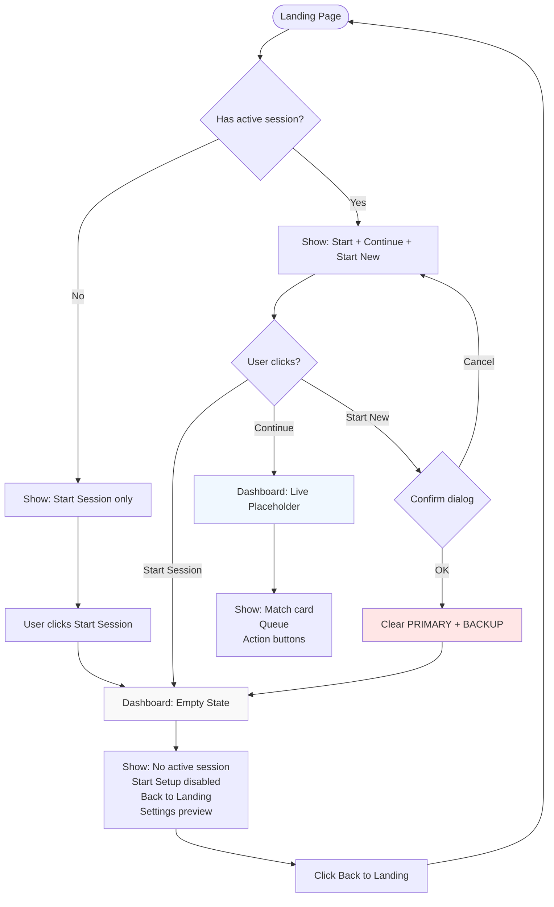

# M1d - Start New Session (Confirm + Wipe) + Dashboard Empty State

## Overview

Make `/dashboard` the single live hub. When no active session exists, dashboard shows an empty state that guides users into setup/settings instead of dead-ending. Complete the "Start New Session" flow with confirmation and storage clearing.

## Current State After M1c

- ✅ Landing page with conditional buttons based on session state
- ✅ Dashboard page with live session placeholder (always visible)
- ✅ Storage detection with TTL (PRIMARY/BACKUP fallback)
- ✅ "Start New Session" button visible but disabled when session exists
- ❌ No confirm dialog for "Start New Session"
- ❌ No storage clearing functionality
- ❌ Dashboard doesn't handle empty state (no session)

## Updated Architecture Vision

**Route consolidation:**

- `/dashboard` is the **canonical route** for everything
- Landing always routes to `/dashboard`
- Dashboard handles BOTH states:
  - Valid session exists → show live session UI
  - No session → show empty state with setup/settings entry

**No separate `/setup` route** - dashboard is the single hub.

---

## Implementation Steps

### 1. Add Storage Clear Function

Create `lib/storage/writer.ts`:

```typescript
import { STORAGE_KEYS } from './constants';

/**
 * Clears all session-related data from localStorage.
 * Removes PRIMARY, BACKUP, and any envelope/meta keys.
 */
export function clearSessionStorage(): void {
  try {
    localStorage.removeItem(STORAGE_KEYS.PRIMARY);
    localStorage.removeItem(STORAGE_KEYS.BACKUP);
    
    // Clear any envelope or meta keys if they exist
    // (Future: envelope key if we add one)
    
    console.log('Session storage cleared');
  } catch (error) {
    console.error('Error clearing session storage:', error);
  }
}
```

**Design notes:**

- Simple, destructive operation
- Removes both PRIMARY and BACKUP
- Logs for debugging
- Handles errors gracefully

---

### 2. Wire "Start New Session" on Landing Page

Update `[components/landing-page.tsx](components/landing-page.tsx)`:

```typescript
'use client';

import { useState, useEffect } from 'react';
import { useRouter } from 'next/navigation';
import { hasActiveSession } from '@/lib/storage/loader';
import { clearSessionStorage } from '@/lib/storage/writer';
// ... other imports

export default function LandingPage() {
  const [hasSession, setHasSession] = useState(false);
  const [isLoading, setIsLoading] = useState(true);
  const router = useRouter();
  
  useEffect(() => {
    setHasSession(hasActiveSession());
    setIsLoading(false);
  }, []);
  
  const handleStartNewSession = () => {
    const confirmed = window.confirm(
      'This will wipe the current session. Continue?'
    );
    
    if (confirmed) {
      clearSessionStorage();
      router.push('/dashboard');
    }
  };
  
  return (
    <section>
      {/* ... existing content ... */}
      
      <div className="mt-10 flex flex-col sm:flex-row gap-4 justify-center lg:justify-start">
        {/* Always show Start Session */}
        <Link href="/dashboard">
          <Button variant="hero" size="hero">
            Start Session
            <ArrowRight />
          </Button>
        </Link>
        
        {/* Show additional buttons if session exists */}
        {!isLoading && hasSession && (
          <>
            <Link href="/dashboard">
              <Button variant="heroOutline" size="hero">
                Continue Session
              </Button>
            </Link>
            <Button 
              variant="outline" 
              size="hero"
              onClick={handleStartNewSession}  {/* NOW WIRED */}
            >
              Start New Session
            </Button>
          </>
        )}
        
        {/* ... rest of content ... */}
      </div>
    </section>
  );
}
```

**Key changes:**

- Add `useRouter` from `next/navigation`
- Import `clearSessionStorage`
- `handleStartNewSession()`:
  - Shows native `window.confirm()` dialog
  - If confirmed: clears storage and routes to `/dashboard`
  - If canceled: does nothing
- "Start New Session" now has `onClick` handler

---

### 3. Add Empty State to Dashboard

Update `[app/dashboard/page.tsx](app/dashboard/page.tsx)`:

```typescript
'use client';

import { useState, useEffect } from 'react';
import Link from 'next/link';
import { hasActiveSession } from '@/lib/storage/loader';
import { Button } from '@/components/ui/button';

export default function DashboardPage() {
  const [hasSession, setHasSession] = useState(false);
  const [isLoading, setIsLoading] = useState(true);
  
  useEffect(() => {
    setHasSession(hasActiveSession());
    setIsLoading(false);
  }, []);
  
  // Loading state
  if (isLoading) {
    return (
      <div className="min-h-screen bg-background flex items-center justify-center">
        <p className="text-muted-foreground">Loading...</p>
      </div>
    );
  }
  
  // Empty state - no active session
  if (!hasSession) {
    return (
      <div className="min-h-screen bg-background">
        <div className="mx-auto max-w-2xl px-5 py-12 space-y-8">
          
          {/* Empty State Message */}
          <div className="text-center space-y-4">
            <h1 className="text-3xl font-bold text-foreground">
              No active session
            </h1>
            <p className="text-lg text-muted-foreground max-w-md mx-auto">
              Start a new session to begin tracking your pickup game rotations.
            </p>
          </div>
          
          {/* CTAs */}
          <div className="flex flex-col sm:flex-row gap-4 justify-center">
            <Button size="lg" className="rounded-xl" disabled>
              Start Setup
              {/* Will be wired in M2 */}
            </Button>
            <Link href="/">
              <Button variant="outline" size="lg" className="rounded-xl">
                Back to Landing
              </Button>
            </Link>
          </div>
          
          {/* Settings Placeholder Area */}
          <div className="mt-12 border border-border rounded-2xl p-6 bg-card">
            <h2 className="text-lg font-semibold text-foreground mb-2">
              Settings
            </h2>
            <p className="text-sm text-muted-foreground mb-4">
              Configure your game settings (Coming in M2)
            </p>
            <div className="space-y-3 opacity-50">
              <div className="flex items-center justify-between py-2">
                <span className="text-sm text-foreground">Team count</span>
                <span className="text-sm text-muted-foreground">4</span>
              </div>
              <div className="flex items-center justify-between py-2">
                <span className="text-sm text-foreground">Goal cap</span>
                <span className="text-sm text-muted-foreground">5</span>
              </div>
              <div className="flex items-center justify-between py-2">
                <span className="text-sm text-foreground">Colors</span>
                <span className="text-sm text-muted-foreground">Enabled</span>
              </div>
            </div>
          </div>
          
        </div>
      </div>
    );
  }
  
  // Live session exists - show existing placeholder
  return (
    <div className="min-h-screen bg-background">
      <div className="mx-auto max-w-2xl px-5 py-6 space-y-5">
        {/* EXISTING LIVE SESSION PLACEHOLDER CODE */}
        {/* (Keep current Match Card, Queue, Action Buttons) */}
        
        <header className="text-center space-y-1">
          <h1 className="text-xl font-semibold text-foreground">Dashboard</h1>
          <p className="text-sm text-muted-foreground">Session view (coming soon)</p>
        </header>
        
        {/* ... rest of existing dashboard code ... */}
        
      </div>
    </div>
  );
}
```

**Key additions:**

- Mark as `'use client'`
- Add session detection with useState/useEffect
- Three render states:
  1. **Loading**: Simple loading message
  2. **Empty state** (no session):
    - "No active session" headline
    - Description text
    - "Start Setup" button (disabled, wired in M2)
    - "Back to Landing" link
    - Settings placeholder panel with mock options
  3. **Live session**: Existing placeholder (match card, queue, buttons)

---

## Design Decisions

**Route consolidation:**

- `/dashboard` handles both empty and active states
- No separate `/setup` route (was discussed but removed)
- Landing always routes to `/dashboard`

**Empty state UX:**

- Clear messaging: "No active session"
- Primary CTA: "Start Setup" (disabled for M1d, wired in M2)
- Secondary CTA: "Back to Landing" (escape hatch)
- Settings panel preview (visual hint of what's coming)

**Confirmation pattern:**

- Use native `window.confirm()` for simplicity
- Clear message: "This will wipe the current session. Continue?"
- Only clears storage if user confirms

**Storage clearing:**

- Destructive operation in dedicated `writer.ts`
- Clears both PRIMARY and BACKUP
- No complex cleanup needed (yet)

---

## User Flows After M1d

### Flow 1: New User (no session)

```
Landing → Click "Start Session" → Dashboard (empty state)
  → See "No active session" + "Start Setup" (disabled) + Settings preview
  → Click "Back to Landing" → returns to landing
```

### Flow 2: Returning User (has active session)

```
Landing → Shows "Continue Session" + "Start New Session"
  → Click "Continue Session" → Dashboard (live placeholder)
  → OR Click "Start New Session" → Confirm dialog → Dashboard (empty state)
```

### Flow 3: Start New Session Flow

```
Landing (with session) → "Start New Session" 
  → Confirm: "This will wipe the current session. Continue?"
  → User clicks OK → Storage cleared → Dashboard (empty state)
  → User clicks Cancel → Nothing happens, stays on landing
```

### Flow 4: Expired Session

```
Landing loads → Auto-detects expired session → Clears storage
  → Shows only "Start Session" button
  → Click "Start Session" → Dashboard (empty state)
```

---

## Testing Checklist

After implementation:

1. **New user flow (no session):**
  - Visit `/` → only "Start Session" visible
  - Click "Start Session" → `/dashboard` empty state
  - See "No active session" headline
  - "Start Setup" button disabled
  - "Back to Landing" works
  - Settings placeholder visible
2. **Returning user (has session):**
  - Add valid session to localStorage
  - Visit `/` → "Continue Session" + "Start New Session" visible
  - Click "Continue Session" → `/dashboard` live placeholder
  - See match card, queue, action buttons
3. **Start New Session (confirm):**
  - With active session, click "Start New Session"
  - Confirm dialog appears
  - Click "OK" → storage cleared → `/dashboard` empty state
  - Verify localStorage empty (PRIMARY and BACKUP gone)
4. **Start New Session (cancel):**
  - With active session, click "Start New Session"
  - Confirm dialog appears
  - Click "Cancel" → nothing happens
  - Verify session still exists
  - Dashboard still shows live placeholder
5. **Direct dashboard visit (no session):**
  - Clear storage manually
  - Visit `/dashboard` directly
  - Should see empty state
6. **Direct dashboard visit (with session):**
  - Add valid session
  - Visit `/dashboard` directly
  - Should see live placeholder

---

## Hard Constraints (Must NOT Include)

- ❌ No actual Setup UI (that's M2)
- ❌ No session creation (that's M2d)
- ❌ No real Settings functionality (that's M7)
- ❌ No reducer/rules engine (that's M4)
- ❌ No tie decision popup (that's M5)
- ❌ No undo functionality (that's M6)
- ❌ No rolling TTL updates (that's M8)

**What IS included:**

- ✅ Confirm dialog for "Start New Session"
- ✅ Storage clearing (PRIMARY + BACKUP)
- ✅ Dashboard empty state UI
- ✅ Settings placeholder panel (visual only)
- ✅ "Back to Landing" escape hatch

---

## Files to Create/Modify

1. Create: `lib/storage/writer.ts` - `clearSessionStorage()` function
2. Modify: `[components/landing-page.tsx](components/landing-page.tsx)` - Wire "Start New Session" button
3. Modify: `[app/dashboard/page.tsx](app/dashboard/page.tsx)` - Add empty state conditional rendering

---

## Architecture After M1d

```
app/
├── page.tsx                     (renders <LandingPage />)
└── dashboard/
    └── page.tsx                (conditional: live placeholder OR empty state)

components/
└── landing-page.tsx            (Start New with confirm + wipe)

lib/storage/
├── constants.ts               (storage keys, TTL, types)
├── loader.ts                  (load/validate, TTL check)
└── writer.ts                  (clearSessionStorage - NEW)

johnny/                        (gitignored, reference only)
```

---

## Flow Diagram




---

## Next Steps After M1d

**M1 complete!** Next up:

- **M2**: Setup UI (team count, colors, goal cap, create session)
- **M3**: Live session screen with real data display
- **M4**: Rules engine + wire action buttons
- **M5**: Tie decision popup (3-team case)
- **M6**: Undo functionality
- **M7**: Settings panel (edit teams, add/remove)
- **M8**: Rolling TTL with activity tracking

